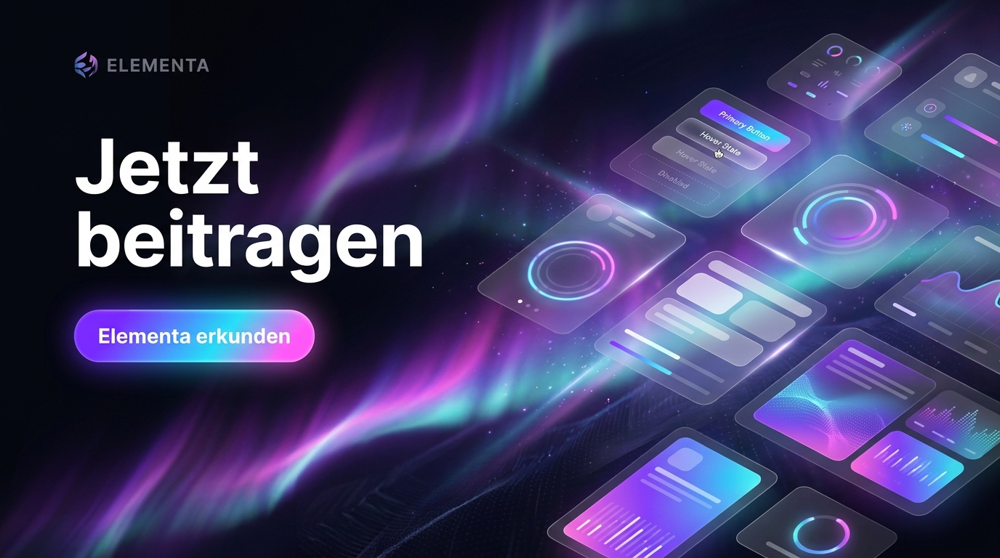
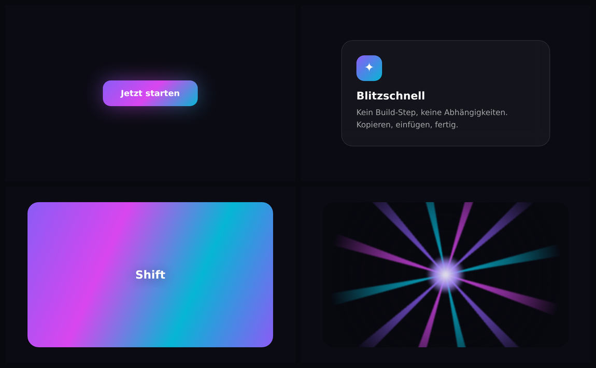
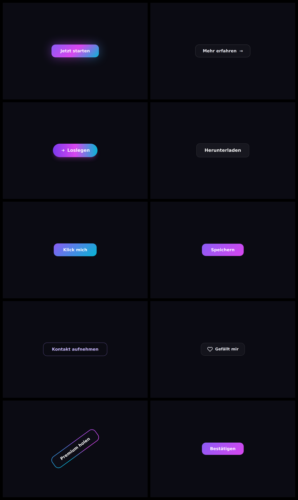
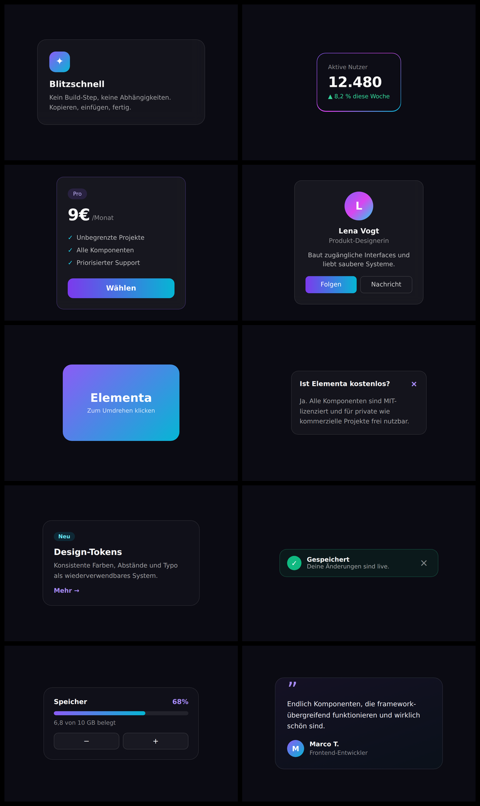
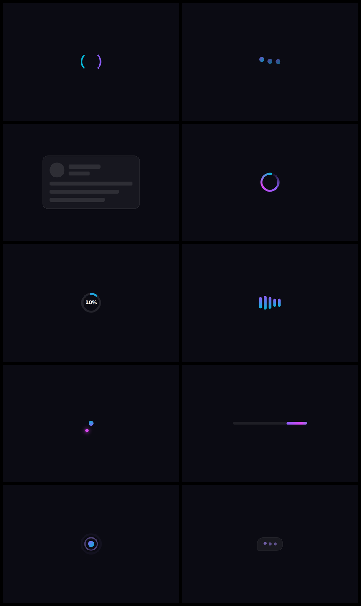
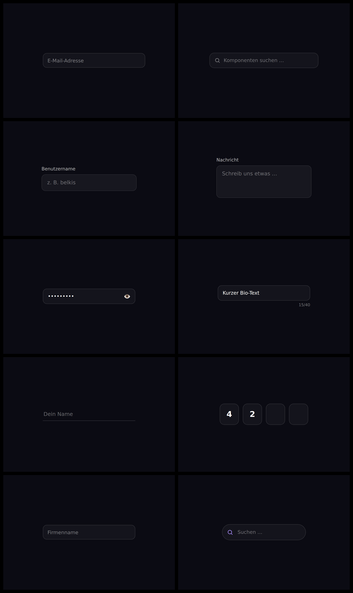
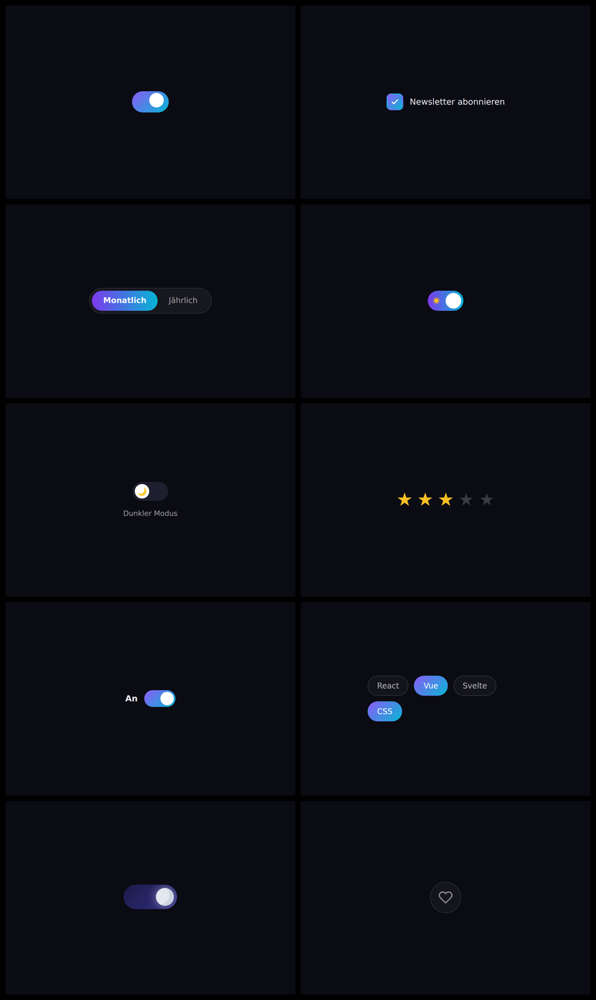
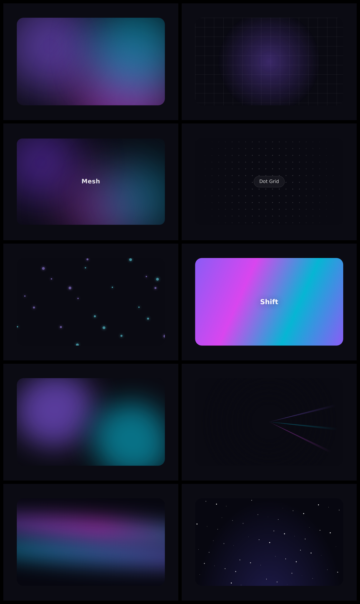

<div align="center">



# Elementa

**Baue bessere Interfaces. Kopiere weniger Code.**

Der offene Baukasten für effektreiche UI-Komponenten — live editierbar, framework­übergreifend, zum Kopieren und Einfügen. Kein npm. Kein Build-Step. In der EU gehostet &amp; DSGVO-konform.

[](https://nextjs.org)
[](https://react.dev)
[](https://www.typescriptlang.org)
[](https://tailwindcss.com)
[](https://appwrite.io)
[](./LICENSE)
[](#datenschutz--rechtliches)

[**Live-Seite**](https://ui.it-handwerk-stuttgart.de) · [**Guides**](https://ui.it-handwerk-stuttgart.de/guides) · [**Mitmachen**](https://ui.it-handwerk-stuttgart.de/docs/contribute) · [**Bug melden**](https://github.com/BEKO2210/ELEMENTA/issues)

</div>

---

## Überblick

**Elementa** ist eine quelloffene UI-Komponenten-Bibliothek für Buttons, Cards, Loader, Inputs, Toggles und Hintergrund-Effekte. Jede Komponente hat eine **live-interaktive Vorschau** — kein Screenshot, keine Überraschungen. Code kopieren, ins Projekt einfügen, fertig.

Anders als React-only-Bibliotheken ist Elementa **framework­übergreifend** und baut auf reinem, standardbasiertem HTML/CSS auf. Alles läuft **self-hosted in der EU**, DSGVO-konform und kostenlos unter der MIT-Lizenz — eine faire Alternative für Entwickler, Agenturen und Teams im deutschsprachigen Raum und darüber hinaus.

> **Gebaut für** Entwickler, Designer und Agenturen, die schnelle, verlässliche und datenschutzkonforme UI-Komponenten wollen — ohne 500 MB `node_modules`.

---

## Galerie

<div align="center">



</div>

Jede Kategorie kommt in **HTML/CSS, Tailwind, React, Vue und Svelte** — echte Framework-Komponenten, nicht nur optisch nachgebaut.

| Buttons | Cards |
|:---:|:---:|
|  |  |
| **Loader** | **Inputs** |
|  |  |
| **Toggles** | **Backgrounds** |
|  |  |

<div align="center"><a href="https://ui.it-handwerk-stuttgart.de/explore"><b>→ Alle Komponenten live ansehen</b></a></div>

---

## Features

- **140+ Komponenten** in Buttons, Cards, Loader, Inputs, Toggles &amp; Backgrounds
- **Live-Vorschau** — jeder Hover-Zustand, jede Animation in einer gehärteten Sandbox, bevor du kopierst
- **Framework­übergreifend** — HTML/CSS, Tailwind, React, Vue oder Svelte
- **Null Abhängigkeiten** — jede Komponente ist eigenständig und leichtgewichtig
- **WCAG-2.2-Anspruch** — geprüfte Kontraste, sichtbarer Fokus, `prefers-reduced-motion`
- **⌘K Command-Palette** für sofortige Navigation und Suche
- **Autocomplete-Suche**, Kategorie-Filter, Sortierung und „ähnliche Komponenten"
- **Guides** — ausführliche CSS- &amp; Barrierefreiheits-Tutorials (SEO / Google-Discover-optimiert)
- **DSGVO-Cookie-Consent** + first-party, einwilligungsbasierte Analytik (keine Dritt-Anbieter)
- **Konten** — Komponenten hochladen, liken, favorisieren und kommentieren
- **Dark-Mode-first** mit Signatur-Verlauf Violett → Fuchsia → Cyan

---

## Tech-Stack

| Ebene         | Technologie                                                       |
| ------------- | ----------------------------------------------------------------- |
| Framework     | [Next.js 16](https://nextjs.org) (App Router, Turbopack)          |
| Sprache       | [TypeScript 5](https://www.typescriptlang.org)                    |
| UI-Runtime    | [React 19](https://react.dev)                                     |
| Styling       | [Tailwind CSS v4](https://tailwindcss.com) (CSS-`@theme`-Tokens)  |
| Animation     | [Framer Motion](https://www.framer.com/motion/)                   |
| Code-Ansicht  | [prism-react-renderer](https://github.com/FormidableLabs/prism-react-renderer) |
| Icons         | [lucide-react](https://lucide.dev) (Brand-Icons als Inline-SVG)   |
| Backend       | [Appwrite](https://appwrite.io) — self-hosted in der EU (Auth, DB, Storage) |
| Schriften     | Inter + JetBrains Mono (über `next/font`)                         |

> Kein Google Analytics, keine Dritt-Tracker, keine US-Cloud-Abhängigkeiten.

---

## Erste Schritte

### Voraussetzungen

- **Node.js 20+**
- Ein **Appwrite**-Projekt (self-hosted oder Cloud) mit einer Datenbank namens `marketplace`

### Installation

```bash
git clone https://github.com/BEKO2210/ELEMENTA.git
cd ELEMENTA
npm install
```

### Umgebungsvariablen

Lege eine `.env.local` im Projekt-Root an:

```bash
# Öffentlich — darf im Browser landen (Web-SDK)
NEXT_PUBLIC_APPWRITE_ENDPOINT=https://<dein-appwrite>/v1
NEXT_PUBLIC_APPWRITE_PROJECT=<deine-projekt-id>

# Nur Server — für die Provisioning-/Seed-Skripte (niemals committen)
APPWRITE_API_KEY=<dein-server-api-key>
```

| Variable                        | Pflicht  | Zweck                                               |
| ------------------------------- | -------- | --------------------------------------------------- |
| `NEXT_PUBLIC_APPWRITE_ENDPOINT` | ✅       | Appwrite-API-Endpunkt                               |
| `NEXT_PUBLIC_APPWRITE_PROJECT`  | ✅       | Appwrite-Projekt-ID                                 |
| `APPWRITE_API_KEY`              | Skripte  | Server-Key für `scripts/*` (Provisioning, Seeding)  |

### Entwicklung

```bash
npm run dev
# → http://localhost:3000
```

### Produktions-Build

```bash
npm run build
npm run start   # liefert den optimierten Build auf Port 3000 aus
```

> **Hinweis:** Datengetriebene Seiten rendern dynamisch, damit neue Uploads und Änderungen sofort erscheinen. Für den öffentlichen/LAN-Zugriff den **Produktions-Build** (`next start`) verwenden — der HMR-Socket des Dev-Servers kann über Nicht-localhost-Hosts brechen.

---

## Backend &amp; Seeding

Elementa nutzt eine Appwrite-Datenbank (`marketplace`) mit den Collections `components`, `profiles`, `likes`, `comments`, `comment_helpful`, `favorites` sowie einem `avatars`-Storage-Bucket.

Der Ordner `scripts/` enthält einmalige Provisioning- und Seed-Werkzeuge (mit Server-API-Key ausführen):

```bash
APPWRITE_API_KEY="<server-key>" node scripts/provision.mjs         # Collections
APPWRITE_API_KEY="<server-key>" node scripts/provision-storage.mjs # avatars-Bucket
APPWRITE_API_KEY="<server-key>" node scripts/seed-new.mjs          # Komponenten seeden (idempotent)
```

---

## Projektstruktur

```
src/
├─ app/                 # Next.js App Router
│  ├─ page.tsx          # Startseite (Hero + Showcase + Featured + Stats)
│  ├─ explore/          # Komponenten-Katalog (Filter, Suche, Sortierung)
│  ├─ c/[slug]/         # Detailseite (Vorschau, Code, Install, Ähnliche)
│  ├─ u/[slug]/         # Öffentliche Autorenprofile
│  ├─ profil/           # Konto-Dashboard & Einstellungen
│  ├─ guides/           # Tutorials (Übersicht + Artikel)
│  ├─ about/            # Über uns / E-E-A-T
│  ├─ impressum · datenschutz · lizenz   # Rechtliches
│  ├─ api/track/        # First-party, einwilligungsbasierte Analytik
│  ├─ sitemap.ts · robots.ts
│  └─ layout.tsx        # Metadaten, Provider, Nav/Footer
├─ components/          # UI- & Feature-Komponenten (SandboxPreview, CodeTabs, …)
└─ lib/                 # data.ts (Appwrite-Reads), appwrite.ts, consent.ts, types.ts
public/brand/           # Logo, OG-Bild, Hero-Video/Poster
scripts/                # Appwrite-Provisioning & Seeding
```

---

## Skripte

| Befehl          | Beschreibung                            |
| --------------- | --------------------------------------- |
| `npm run dev`   | Dev-Server starten (Turbopack)          |
| `npm run build` | Optimierten Produktions-Build erstellen |
| `npm run start` | Produktions-Build ausliefern (Port 3000)|
| `npm run lint`  | ESLint ausführen                        |

---

## So schneidet Elementa ab

| Feature               | **Elementa** | shadcn/ui | Uiverse   | CodePen |
| --------------------- | :----------: | :-------: | :-------: | :-----: |
| Kostenlos             |      ✅      |     ✅    |     ✅    |    ✅   |
| Frameworks            |     Alle     | React     | HTML/CSS  | Alle    |
| Live-Vorschau         |      ✅      |     ❌    |     ✅    |    ✅   |
| Kuratiert / geprüft   |      ✅      |     ✅    |     ⚠️    |    ❌   |
| WCAG-geprüft          |      ✅      |     ❌    |     ❌    |    ❌   |
| DSGVO / EU-Hosting     |      ✅      |     ❓    |     ❓    |    ❌   |
| Null Abhängigkeiten   |      ✅      |     ❌    |     ✅    |    ✅   |

<sub>Vergleich nach bestem Wissen (Stand 2026); andere Projekte entwickeln sich weiter.</sub>

---

## Deployment

Elementa ist eine standardmäßige Next.js-App und läuft auf jedem Node-Host.

- Mit `npm run build` bauen, dann `npm run start` hinter Reverse-Proxy oder Tunnel betreiben.
- Die Referenz-Installation läuft auf einem EU-Server, exponiert über einen **Cloudflare-Tunnel** auf Port `3000`.
- Security-Header (CSP, HSTS, `X-Content-Type-Options`, `Permissions-Policy`) sind in `next.config.ts` konfiguriert.

---

## Roadmap

- [x] 70+ Komponenten mit Live-Vorschau &amp; Theme-Switcher
- [x] ⌘K Command-Palette, Autocomplete-Suche, Filter &amp; Sortierung
- [x] Konten, Likes, Favoriten, Kommentare &amp; öffentliche Profile
- [x] Guides-Bereich (CSS- &amp; Barrierefreiheits-Tutorials)
- [x] DSGVO-Cookie-Consent + First-party-Analytik
- [ ] Framework-spezifische Code-Ausgabe (React-/Vue-/Svelte-Konvertierung)
- [ ] Komponenten-Collections (z. B. „Dashboard Starter Kit")
- [ ] Bewertungen &amp; erweiterte Discovery
- [ ] Öffentliche API &amp; optionales npm-Paket

---

## Mitmachen

Beiträge sind willkommen! Der schnellste Weg:

1. Kostenloses Konto auf der [Live-Seite](https://ui.it-handwerk-stuttgart.de) erstellen
2. Komponente in HTML/CSS bauen (optional JS)
3. Über das Upload-Formular einreichen — sie durchläuft einen Qualitäts-Review
4. Nach Freigabe ist sie live für die Community

Für Code-Beiträge zur Plattform selbst: Issue oder PR öffnen. Siehe [CONTRIBUTING.md](./CONTRIBUTING.md) und die [Contributor-Guidelines](https://ui.it-handwerk-stuttgart.de/docs/contribute).

**Anforderungen an Komponenten:** valides HTML5/CSS3 · keine undeklarierten externen Abhängigkeiten · mind. 50 Zeichen Beschreibung · sinnvolle Tags · respektiert `prefers-reduced-motion`.

---

## Datenschutz &amp; Rechtliches

- **Kein Tracking durch Dritte** — ausschließlich first-party, einwilligungsbasierte Analytik
- **In der EU gehostet** — alle Daten bleiben innerhalb der Europäischen Union
- **Cookie-Consent** für alles über technisch notwendigen Speicher hinaus

Siehe [Datenschutzerklärung](https://ui.it-handwerk-stuttgart.de/datenschutz) und [Impressum](https://ui.it-handwerk-stuttgart.de/impressum).

---

## Lizenz

Lizenziert unter der **MIT-Lizenz** — frei für kommerzielle und private Nutzung, Modifikation und Verteilung, ohne Gewährleistung oder Haftung. Siehe [LICENSE](./LICENSE).

Auf der Plattform geteilte Komponenten stehen ebenfalls unter MIT, sofern nicht ausdrücklich anders angegeben.

---

## Autor

**Belkis Aslani**

- Website — [ui.it-handwerk-stuttgart.de](https://ui.it-handwerk-stuttgart.de)
- GitHub — [@BEKO2210](https://github.com/BEKO2210)

<div align="center"><sub>Gebaut mit Next.js, React, Tailwind CSS und Appwrite · Erstellt &amp; gehostet in der EU</sub></div>
