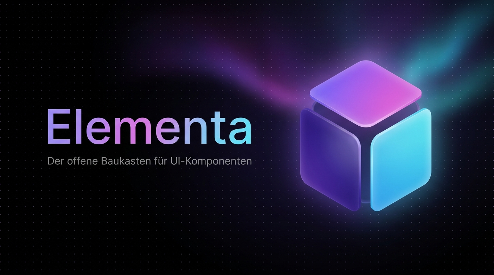

<div align="center">



# Elementa

**Baue bessere Interfaces. Kopiere weniger Code.**

The open component library for effect‑rich UI — live‑previewed, framework‑agnostic, copy‑and‑paste. No npm install. No build step. EU‑hosted &amp; GDPR‑compliant.

[](https://nextjs.org)
[](https://react.dev)
[](https://www.typescriptlang.org)
[](https://tailwindcss.com)
[](https://appwrite.io)
[](./LICENSE)
[](#privacy--legal)

[**Live Site**](https://ui.it-handwerk-stuttgart.de) · [**Guides**](https://ui.it-handwerk-stuttgart.de/guides) · [**Contribute**](https://ui.it-handwerk-stuttgart.de/docs/contribute) · [**Report a Bug**](https://github.com/BEKO2210/ELEMENTA/issues)

</div>

---

## Overview

**Elementa** is an open‑source UI component library for buttons, cards, loaders, inputs, toggles and background effects. Every component ships with a **live, interactive preview** — no screenshots, no surprises. Copy the code, paste it into your project, done.

Unlike React‑only libraries, Elementa is **framework‑agnostic** and built around plain, standards‑based HTML/CSS. It is fully **self‑hosted in the EU**, GDPR‑compliant, and free under the MIT license — a fair alternative for developers, agencies and teams in the German‑speaking market and beyond.

> **Built for** developers, designers and agencies who want fast, reliable, privacy‑compliant UI components without a 500 MB `node_modules`.

---

## Features

- **70+ components** across Buttons, Cards, Loaders, Inputs, Toggles &amp; Backgrounds
- **Live preview** — test every hover state, animation and effect in a hardened sandbox before copying
- **Framework‑agnostic** — HTML/CSS, Tailwind, React, Vue or Svelte
- **Zero dependencies** — each component is standalone and lightweight
- **WCAG 2.2 mindset** — checked contrasts, visible focus, `prefers-reduced-motion`
- **⌘K command palette** for instant navigation and search
- **Autocomplete search**, category filters, sorting and related‑component discovery
- **Guides** — in‑depth CSS &amp; accessibility tutorials (SEO / Google Discover ready)
- **GDPR cookie consent** + first‑party, consent‑gated analytics (no third parties)
- **Accounts** — upload, like, favorite and comment on components
- **Dark‑mode first** design with a signature violet → fuchsia → cyan palette

---

## Tech Stack

| Layer        | Technology                                                        |
| ------------ | ----------------------------------------------------------------- |
| Framework    | [Next.js 16](https://nextjs.org) (App Router, Turbopack)          |
| Language     | [TypeScript 5](https://www.typescriptlang.org)                    |
| UI runtime   | [React 19](https://react.dev)                                     |
| Styling      | [Tailwind CSS v4](https://tailwindcss.com) (CSS `@theme` tokens)  |
| Animation    | [Framer Motion](https://www.framer.com/motion/)                   |
| Code display | [prism-react-renderer](https://github.com/FormidableLabs/prism-react-renderer) |
| Icons        | [lucide-react](https://lucide.dev) (brand icons inlined as SVG)   |
| Backend      | [Appwrite](https://appwrite.io) — self‑hosted in the EU (Auth, DB, Storage) |
| Fonts        | Inter + JetBrains Mono (via `next/font`)                          |

> No Google Analytics, no third‑party trackers, no US cloud dependencies.

---

## Getting Started

### Prerequisites

- **Node.js 20+**
- An **Appwrite** project (self‑hosted or cloud) with a database named `marketplace`

### Installation

```bash
git clone https://github.com/BEKO2210/ELEMENTA.git
cd ELEMENTA
npm install
```

### Environment Variables

Create a `.env.local` in the project root:

```bash
# Public — safe to expose (used by the browser SDK)
NEXT_PUBLIC_APPWRITE_ENDPOINT=https://<your-appwrite>/v1
NEXT_PUBLIC_APPWRITE_PROJECT=<your-project-id>

# Server‑only — used by the provisioning/seed scripts (never commit this)
APPWRITE_API_KEY=<your-server-api-key>
```

| Variable                        | Required | Purpose                                            |
| ------------------------------- | -------- | -------------------------------------------------- |
| `NEXT_PUBLIC_APPWRITE_ENDPOINT` | ✅       | Appwrite API endpoint                              |
| `NEXT_PUBLIC_APPWRITE_PROJECT`  | ✅       | Appwrite project ID                                |
| `APPWRITE_API_KEY`              | scripts  | Server key for `scripts/*` (provisioning, seeding) |

### Development

```bash
npm run dev
# → http://localhost:3000
```

### Production Build

```bash
npm run build
npm run start   # serves the optimized build on port 3000
```

> **Note:** Data‑backed pages render dynamically so new uploads and edits appear immediately. Serve the **production build** (`next start`) for public/LAN access — the dev server’s HMR socket can break over non‑localhost hosts.

---

## Backend &amp; Seeding

Elementa uses an Appwrite database (`marketplace`) with the collections `components`, `profiles`, `likes`, `comments`, `comment_helpful`, `favorites` and an `avatars` storage bucket.

The `scripts/` folder contains one‑off provisioning and seeding utilities (run with a server API key):

```bash
APPWRITE_API_KEY="<server-key>" node scripts/provision.mjs        # collections
APPWRITE_API_KEY="<server-key>" node scripts/provision-storage.mjs # avatars bucket
APPWRITE_API_KEY="<server-key>" node scripts/seed-new.mjs         # seed components (idempotent)
```

---

## Project Structure

```
src/
├─ app/                 # Next.js App Router
│  ├─ page.tsx          # Home (hero + showcase + featured + stats)
│  ├─ explore/          # Component catalog (filter, search, sort)
│  ├─ c/[slug]/         # Component detail (preview, code, install, related)
│  ├─ u/[slug]/         # Public author profiles
│  ├─ profil/           # Account dashboard & settings
│  ├─ guides/           # Tutorials (index + articles)
│  ├─ about/            # About / E‑E‑A‑T
│  ├─ impressum · datenschutz · lizenz   # Legal (DE)
│  ├─ api/track/        # First‑party, consent‑gated analytics endpoint
│  ├─ sitemap.ts · robots.ts
│  └─ layout.tsx        # Metadata, providers, nav/footer
├─ components/          # UI + feature components (SandboxPreview, CodeTabs, …)
└─ lib/                 # data.ts (Appwrite reads), appwrite.ts, consent.ts, types.ts
public/brand/           # Logo, OG image, hero video/poster
scripts/                # Appwrite provisioning & seeding
```

---

## Scripts

| Command         | Description                          |
| --------------- | ------------------------------------ |
| `npm run dev`   | Start the dev server (Turbopack)     |
| `npm run build` | Create an optimized production build |
| `npm run start` | Serve the production build (port 3000)|
| `npm run lint`  | Run ESLint                           |

---

## How Elementa Compares

| Feature            | **Elementa** | shadcn/ui | Uiverse   | CodePen |
| ------------------ | :----------: | :-------: | :-------: | :-----: |
| Free               |      ✅      |     ✅    |     ✅    |    ✅   |
| Frameworks         |   All major  | React     | HTML/CSS  | All     |
| Live preview       |      ✅      |     ❌    |     ✅    |    ✅   |
| Curated / reviewed |      ✅      |     ✅    |     ⚠️    |    ❌   |
| WCAG‑checked       |      ✅      |     ❌    |     ❌    |    ❌   |
| GDPR / EU‑hosted   |      ✅      |     ❓    |     ❓    |    ❌   |
| Zero dependencies  |      ✅      |     ❌    |     ✅    |    ✅   |

<sub>Comparison to the best of our knowledge (2026); other projects evolve.</sub>

---

## Deployment

Elementa is a standard Next.js app and runs on any Node host.

- Build with `npm run build`, then run `npm run start` behind a reverse proxy or tunnel.
- The reference deployment runs on an EU server exposed via a **Cloudflare Tunnel** on port `3000`.
- Security headers (CSP, HSTS, `X-Content-Type-Options`, `Permissions-Policy`) are configured in `next.config.ts`.

---

## Roadmap

- [x] 70+ components with live preview &amp; theme switcher
- [x] ⌘K command palette, autocomplete search, filters &amp; sorting
- [x] Accounts, likes, favorites, comments &amp; public profiles
- [x] Guides section (CSS &amp; accessibility tutorials)
- [x] GDPR cookie consent + first‑party analytics
- [ ] Framework‑specific code output (React / Vue / Svelte conversion)
- [ ] Component collections (e.g. “Dashboard Starter Kit”)
- [ ] Ratings &amp; richer discovery
- [ ] Public API &amp; optional npm package

---

## Contributing

Contributions are welcome! The quickest path:

1. Create a free account on the [live site](https://ui.it-handwerk-stuttgart.de)
2. Build your component in HTML/CSS (optional JS)
3. Submit it via the upload form — it goes through a quality review
4. Once approved, it’s live for the community

For code contributions to the platform itself, open an issue or PR. See [CONTRIBUTING.md](./CONTRIBUTING.md) and the [Contributor Guidelines](https://ui.it-handwerk-stuttgart.de/docs/contribute).

**Component requirements:** valid HTML5/CSS3 · no undeclared external dependencies · ≥ 50‑character description · sensible tags · respects `prefers-reduced-motion`.

---

## Privacy &amp; Legal

- **No third‑party tracking** — first‑party, consent‑gated analytics only
- **EU‑hosted** — all data stays within the European Union
- **Cookie consent** for anything beyond technically necessary storage

See the [Privacy Policy](https://ui.it-handwerk-stuttgart.de/datenschutz) and [Imprint](https://ui.it-handwerk-stuttgart.de/impressum).

---

## License

Licensed under the **MIT License** — free for commercial and private use, modification and distribution, without warranty or liability. See [LICENSE](./LICENSE).

Components shared on the platform are MIT‑licensed unless explicitly stated otherwise.

---

## Author

**Belkis Aslani**

- Website — [ui.it-handwerk-stuttgart.de](https://ui.it-handwerk-stuttgart.de)
- GitHub — [@BEKO2210](https://github.com/BEKO2210)

<div align="center"><sub>Built with Next.js, React, Tailwind CSS and Appwrite · Made &amp; hosted in the EU</sub></div>
